<!doctype html>
<html>
    <head>
        <title>projet "لمسة"</title>
        <link rel="icon" href="images/icon.jpg">
    </head>
    <body style="background-color: rgb(231, 255, 255);">

         
        
        

        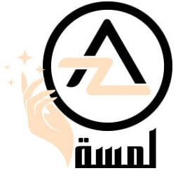
        

        <h1 style="text-align: center;">"كل صباح لا تنسى خذ معك لمسة"</h1>

         

        

            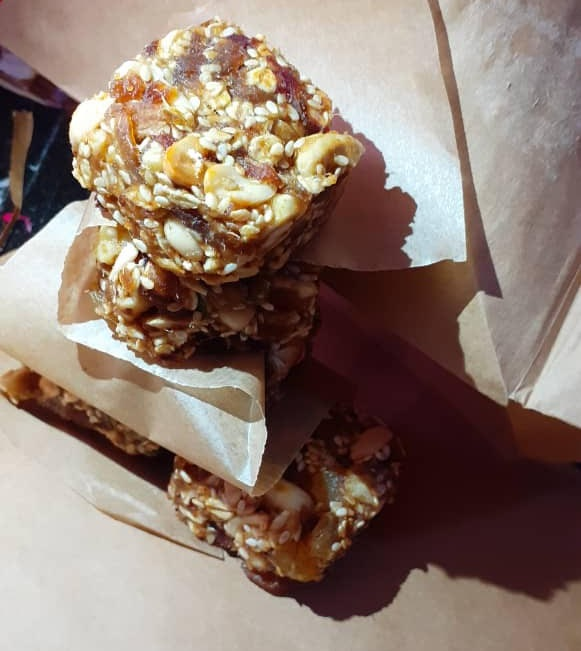
            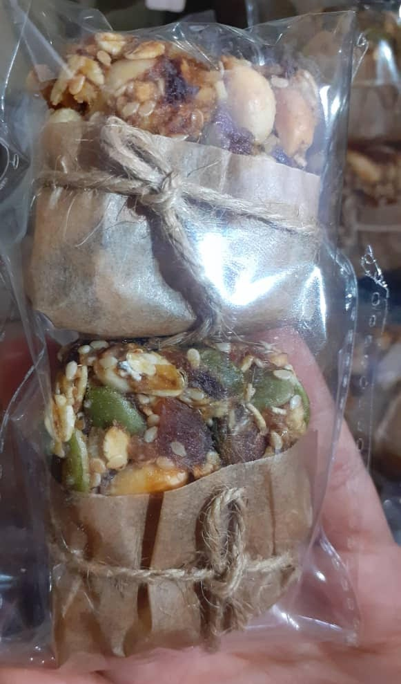
        

         

        

            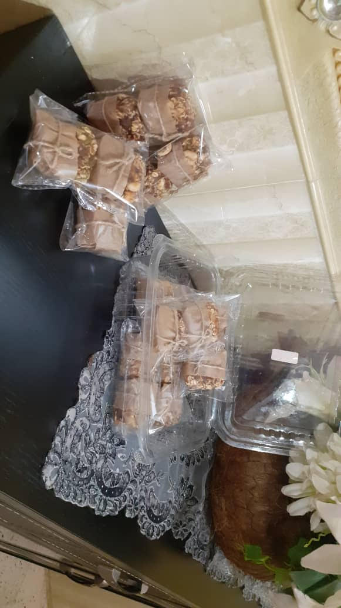
            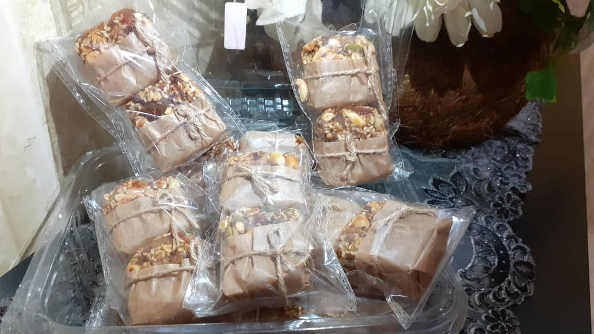
        

         

        

            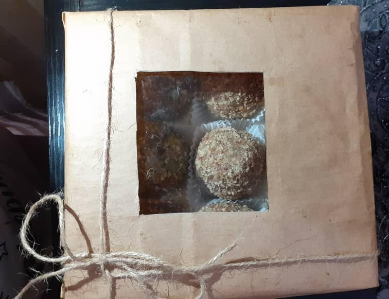
            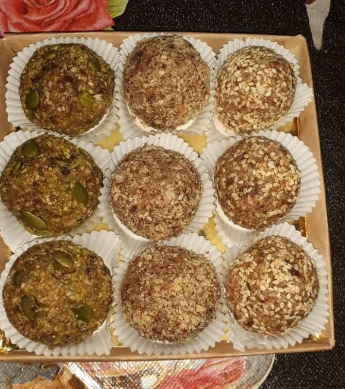
        

         

        

            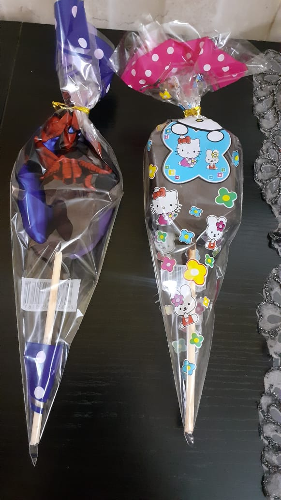
            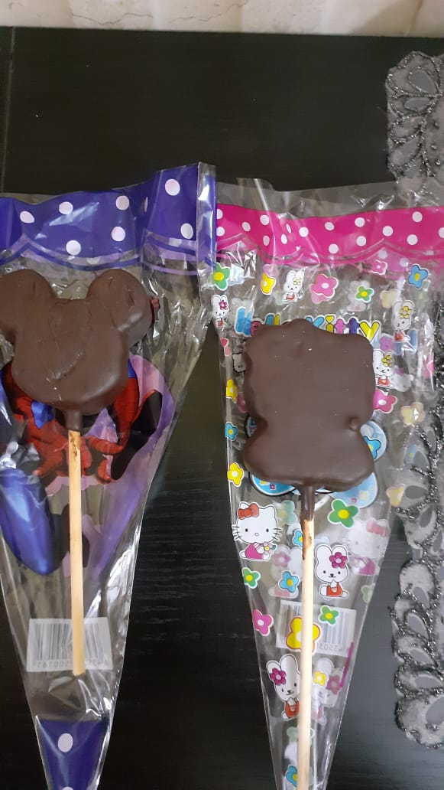
        

         

        

            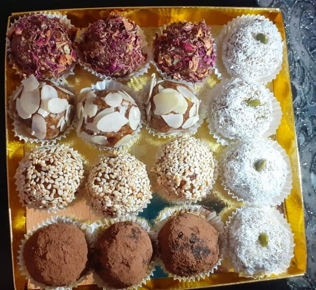
            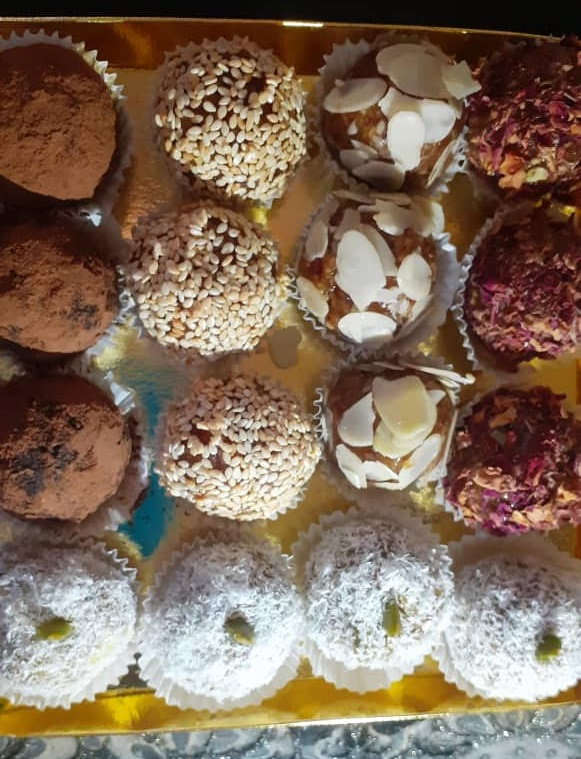
        

         

        

            <video src="video/vid1.mp4" controls></video>
        

         

        

        
            <h3><u>Liste des ingrédients :</u></h3>
        
        <ul>
            
            <li>dattes</li>
            <li>amandes</li>
            <li>Noix de cajou</li>
            <li>pistaches</li>
            <li>Noix</li>
            <li>avoine</li>
            <ul>
                <li>Graines (sésame,courge)</li>
            </ul>
            <li>Raisines jaunes</li>
            <li>chocolat noir</li>
        </ul>  
        
        

         

        <h3><u>Tableau ntrisinalle:</u></h3>

        <table border="1" style="text-align: center;" width="650">
            <tr >
                <th style="background-color: plum;">Valeurs nutritionnelles</th>
                <th style="background-color: linen;">pour 100g/ل 100 غ</th>
                <th style="background-color: lavenderblush;">القيمة الغذائية</th>
            </tr>
            <tr>
                <td style="background-color: plum;">Macronutriments</td>
                <td style="background-color: linen;"></td>
                <td style="background-color: lavenderblush;"></td>
            </tr>
            <tr>
                <td style="background-color: plum;">Énergie (Kj)</td>
                <td style="background-color: linen;">3000</td>
                <td style="background-color: lavenderblush;">طاقة(Kj)</td>
            </tr>
            <tr>
                <td style="background-color: plum;">Calories (kcal)</td>
                <td style="background-color: linen;">909</td>
                <td style="background-color: lavenderblush;">سعرات حرارية(Kcal)</td>
            </tr>
            <tr>
                <td style="background-color: plum;">Protéines (g)</td>
                <td style="background-color: linen;">35</td>
                <td style="background-color: lavenderblush;">بروتينات (غ)</td>
            </tr>
            <tr>
                <td style="background-color: plum;">Glucides (g)</td>
                <td style="background-color: linen;">114,5</td>
                <td style="background-color: lavenderblush;">كربوهيدرات (غ)</td>
            </tr>
            <tr>
                <td style="background-color: plum;">Sucres (g)</td>
                <td style="background-color: linen;">103</td>
                <td style="background-color: lavenderblush;">سكريات (غ)</td>
            </tr>
            <tr>
                <td style="background-color: plum;">Lipides (g)</td>
                <td style="background-color: linen;">35,7</td>
                <td style="background-color: lavenderblush;">دهون (غ)</td>
            </tr>
            <tr>
                <td style="background-color: plum;">Lipides saturés (g)</td>
                <td style="background-color: linen;">6,9</td>
                <td style="background-color: lavenderblush;">دهون مشبعة (غ)</td>
            </tr>
            <tr>
                <td style="background-color: plum;">Fer (mg)</td>
                <td style="background-color: linen;">3,5</td>
                <td style="background-color: lavenderblush;">حديد (مغ)</td>
            </tr>
            <tr>
                <td style="background-color: plum;">Magnésium (mg)</td>
                <td style="background-color: linen;">230</td>
                <td style="background-color: lavenderblush;">مغنيزيوم (مغ)</td>
            </tr>
            <tr>
                <td style="background-color: plum;">Phosphore (mg)</td>
                <td style="background-color: linen;">371</td>
                <td style="background-color: lavenderblush;">فسفور (مغ)</td>
            </tr>
            <tr>
                <td style="background-color: plum;">Vitamine E (mg)</td>
                <td style="background-color: linen;">8,8</td>
                <td style="background-color: lavenderblush;">فيتامين (مغ)</td>
            </tr>
            <tr>
                <td style="background-color: plum;">Potassium (mg)</td>
                <td style="background-color: linen;">696</td>
                <td style="background-color: lavenderblush;">البوتاسيوم (مغ)</td>
            </tr>
        </table>

         
    
    </body>

</html>
